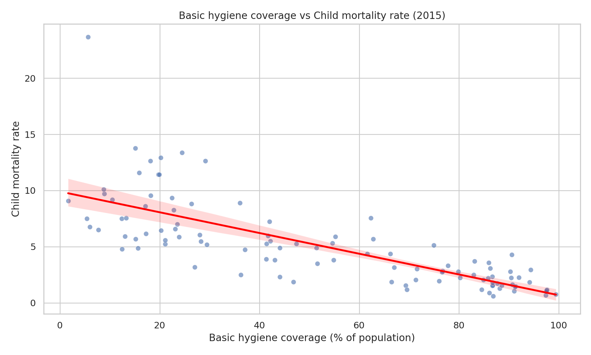
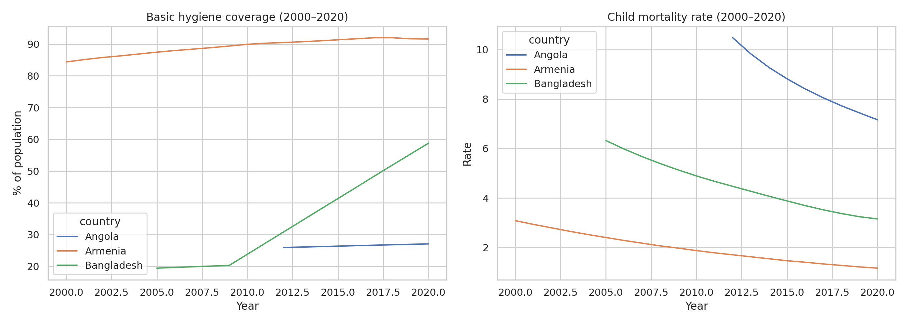

# Hygiene-Child-Mortality-Mini-Project
Data analysis project exploring whether higher access to basic handwashing facilities is associated with lower child mortality across countries, using Our World in Data (2000–2020). Includes a 2015 cross‑section and time series for Bangladesh, Angola and Armenia.
## Introduction
This project explores the relationship between basic hygiene coverage and child mortality across countries. Using country‑year data from Our World in Data (2000–2020), I focus on a cross‑section for 2015 to examine whether countries with higher access to basic handwashing facilities tend to have lower child mortality rates. In addition, I analyze time series for Bangladesh, Angola and Armenia to illustrate how changes in hygiene coverage over time may be associated with improvements in child health outcomes. This work connects my background in Basic Sanitation and my internship experience at COMPESA with a data‑driven perspective on how WASH‑related policies can support healthier cities and communities.

# Basic Hygiene Coverage vs Child Mortality (OWID, 2000–2020)

## Project scope
**Question:** Is higher basic hygiene coverage associated with lower child mortality across countries?

**Data:** OWID country-year data (2000–2020), cross-section in 2015; time series for Bangladesh, Angola, and Armenia.

## Data
- Source: Our World in Data (OWID)
- Hygiene indicator: `hyg_bas_pop__residence_total` (converted from number of people to **% of population** using OWID population data)
- Health indicator: `Child mortality rate`
- Period: 2000–2020
- Cross-section year: 2015

## Method
1. Loaded hygiene and child mortality datasets (country-year format).
2. Converted hygiene from number of people to **percentage of population** using OWID population data.
3. Filtered years (2000–2020) and merged datasets by `country` and `year`.
4. Computed Pearson correlation for 2015.
5. Produced:
   - Scatter plot (2015) with trendline
   - Time series (2000–2020) for selected countries

## Key findings
- In 2015, basic hygiene coverage and child mortality showed a **strong negative association** across countries (**Pearson r = -0.76**, **n = 104** countries).
- The 2015 scatter plot suggests that countries with **higher basic hygiene coverage** tend to have **lower child mortality rates**.
- In the 2000–2020 time series, **Bangladesh** shows a clear increase in basic hygiene coverage alongside a decline in child mortality.
- **Angola** remains with lower hygiene coverage and higher child mortality compared to **Armenia**, which has higher coverage and consistently low mortality.

## Figures

## Files
- Notebook: your `.ipynb` file
- Data: `data/merged_hygiene_child_mortality_2000_2020.csv`
- Figures: `figures/`

## Limitations
This is an observational analysis. Correlation does not imply causation, and multiple factors (income, healthcare access, nutrition, education) can influence child mortality.
This is an observational analysis. Correlation does not imply causation, and multiple factors (income, healthcare access, nutrition, education) can influence child mortality.

